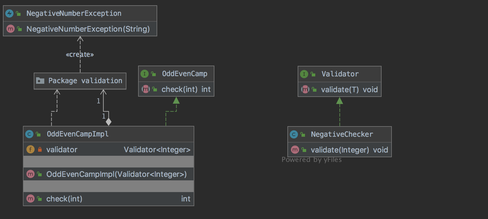

#   AI and Spock a Groovy Combo

## Overview
### Topics 
- uses Groovy as language
- data driven testing (DDT)
  - first class feature
- behavior-driven development (BDD)
  - The result are tests that read like acceptance criteria for a given function
- sweet reporting
- compatible with Gradle and Maven
- runs on Java 8+ and Groovy 3.0+
- sputnik (Spock + Junit) runs on JUnit runner 
 
### Delivered in Example
- Specification spock.lang.*
- Fixture Methods [setupSpec(), cleanupSpec()] [setup(), cleanup()]
- Blocks setup -> stimulus -> response -> cleanup➰where
- Conditions plain boolean expressions Groovy Truth
- Interactions & Mocks behavior of objects not just checking state i.e. outcome

### Demonstration
Implementation of the OddEvenCamp interface implementing the requirements: 
```
Create a method that checks if the integer value is an even or odd number, 
return 1 for even and 0 for odd. If number is 0 or negative number throw a runtime exception.
```


### Diagram



### Reference Documentation

For further reference, please consider the following sections:

* [Spockframework](https://spockframework.org/)

prompt
```
Implement the OddEvenCamp interface
```
Context
 - oddeven.png image
 - entire project
