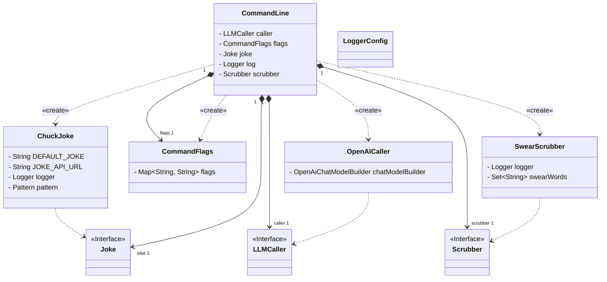

```mermaid
classDiagram
direction TB
class ChuckJoke {
- String DEFAULT_JOKE
- String JOKE_API_URL
- Logger logger
- Pattern pattern
  }
  class CommandFlags {
- Map~String, String~ flags
  }
  class CommandLine {
- LLMCaller caller
- CommandFlags flags
- Joke joke
- Logger log
- Scrubber scrubber
  }
  class Joke {
  <<Interface>>

}
class LLMCaller {
<<Interface>>

}
class LoggerConfig
class OpenAICaller {
- OpenAiChatModelBuilder chatModelBuilder
  }
  class Scrubber {
  <<Interface>>

}
class SwearScrubber {
- Logger logger
- Set~String~ swearWords
  }

ChuckJoke  ..>  Joke
CommandLine  ..>  ChuckJoke : «create»
CommandLine "1" *--> "flags 1" CommandFlags
CommandLine  ..>  CommandFlags : «create»
CommandLine "1" *--> "joke 1" Joke
CommandLine "1" *--> "caller 1" LLMCaller
CommandLine  ..>  OpenAICaller : «create»
CommandLine "1" *--> "scrubber 1" Scrubber
CommandLine  ..>  SwearScrubber : «create»
OpenAICaller  ..>  LLMCaller
SwearScrubber  ..>  Scrubber 

```
