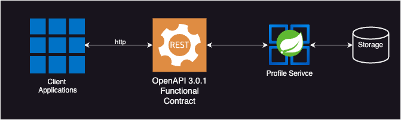

# Functional Testing a Restful Webservice

## Overview

This Java Spring Boot project serves as a live coding demonstration for showcasing the capabilities of Codiumate
plugin in Functional Testing a OpenAPI 3.0.1 Restful Service.



## Usage

1. Clone this repository to your local development environment.

   ```shell
   git clone git@github.com:Codium-ai/devlabs.git
   ```

2. Set up your development environment with Codiumate and the necessary Java development tools.
3. Demonstrate the endpoints for Profile component:
      ``` 
      curl --location 'http://localhost:8585/profile/1234' 
      ```
      ``` 
      curl --location 'http://localhost:8585/profile/' --header 'Content-Type: application/json' --data '{"id":1,"name":"Mike Meyers"}' 
      ```
      ``` 
      curl --location 'http://localhost:8585/profile/users' 
      ```
## Video Summary
1. Context
   - Focus on: ProfileFunctionalSpec.groovy
   - Additional Context: api-docs.json
   
2. Prompt:
   ```
   Add to this Spock Framework integration tests in ProfileFunctionalSpec using the "when-where-then" format of the testing DSL. The integration tests should test the api definitions that are located in the api-docs.json file that is included, sending requests with dynamic data specified in the "where" data table.
   ```
3. Add output to ProfileFunctionalSpec.groovy
   - Run the functional tests of the API

## Resources
- [Spring Boot Documentation](https://spring.io/projects/spring-boot)
- [Martin Fowloer Refactoring](https://refactoring.com)
- [Spockframework](https://spockframework.org)


